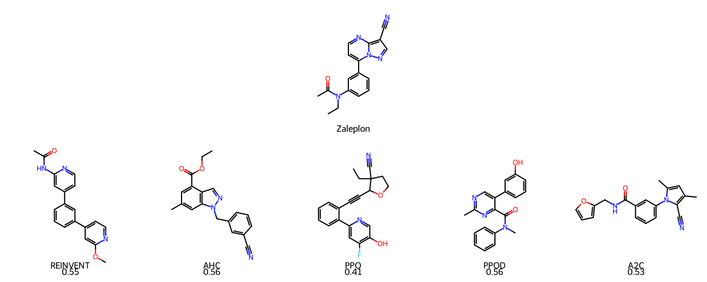

# AceGen: A TorchRL-based toolkit for reinforcement learning in generative chemistry

## Overview

In recent years, reinforcement learning (RL) has been increasingly used in drug design to propose molecules with specific properties under defined constraints. However, RL problems are inherently complex, featuring independent and interchangeable components with diverse method signatures and data requirements.

AceGen applies TorchRL - a modern general decision-making library that provides well-integrated reusable components - to make a robust toolkit tailored for generative drug design.

## Installation

### Conda environment

To create the conda / mamba environment, run

    conda create -n acegen python=3.10 -y
    conda activate acegen
    pip3 install --pre torch --index-url https://download.pytorch.org/whl/nightly/cu121
    
### Install Tensordict

To install Tensordict, run

    git clone https://github.com/pytorch/tensordict.git
    cd tensordict
    python setup.py install

### Install TorchRL

To install TorchRL, run

    git clone https://github.com/pytorch/rl.git
    cd rl
    python setup.py install

### Install MolScore

To install MolScore, run

    pip3 install rdkit func_timeout dask distributed pystow zenodo_client matplotlib scipy pandas joblib seaborn molbloom Levenshtein
    git clone https://github.com/MorganCThomas/MolScore.git
    cd molscore
    git checkout develop
    python setup.py install

### Install AceGen

To install AceGen, run

    pip3 install tqdm wandb hydra-core
    cd acegen-open
    python setup.py install

## Running training scripts

To run the training scripts, run

    python scripts/a2c/a2c.py
    python scripts/ppo/ppo.py
    python scripts/reinvent/reinvent.py
    python scripts/ahc/ahc.py

To modify training parameters, edit the corresponding YAML file in each example's directory.

# Available models

We provide a variety of example priors that can be selected in the configuration file. These include:

- A Gated Recurrent Unit (GRU) model
  - pre-training dataset1 (default): [ChEMBL](https://www.ebi.ac.uk/chembl/)
  - pre-training dataset2: [ZINC250k](https://github.com/wenhao-gao/mol_opt/blob/main/data/zinc.txt.gz)
  - umber of parameters: 4,363,045

- A Long Short-Term Memory (LSTM) model
  - pre-training dataset: [ChEMBL](https://www.ebi.ac.uk/chembl/)
  - number of parameters: 5,807,909
 

- A GPT-2 model
  - pre-training dataset: [REAL 350/3 lead-like, 613.86M cpds, CXSMILES](https://enamine.net/compound-collections/real-compounds/real-database-subsets)
  - number of parameters: 5,030,400

  
# Integration of custom models

We encourage users to integrate their own models into AceGen, modifying the existing code as needed.

`/acegen/models/gru.py` and `/acegen/models/lstm.py` offer methods to create RNNs of varying sizes, which can be use
to load custom models. Similarly, `/acegen/models/gpt2.py` can serve as a template for integrating HuggingFace models. 

# Results on the [MolOpt](https://arxiv.org/pdf/2206.12411.pdf) benchmark

Algorithm comparison for the Area Under the Curve (AUC) of the top 100 molecules on MolOpt benchmark scoring functions. 
Each algorithm ran 5 times with different seeds, and results were averaged. We used the default configuration for each algorithm, including the GRU model for the prior.

| Task                       | Reinvent | AHC   | A2C   | PPO   | PPOD  |
|----------------------------|----------|-------|-------|-------|-------|
| Albuterol_similarity       | 0.569    | 0.640 | 0.478 | 0.816 | **0.861** |
| Amlodipine_MPO             | 0.506    | 0.505 | 0.475 | 0.503 | **0.564** |
| C7H8N2O2                   | 0.615    | 0.563 | 0.616 | 0.805 | **0.837** |
| C9H10N2O2PF2Cl             | 0.556    | 0.553 | 0.488 | 0.654 | **0.728** |
| Celecoxxib_rediscovery     | 0.566    | **0.590** | 0.331 | 0.480 | 0.584 |
| Deco_hop                   | 0.602    | **0.616** | 0.577 | 0.584 | 0.605 |
| Fexofenadine_MPO           | 0.668    | 0.680 | 0.639 | 0.591 | **0.715** |
| Median_molecules_1         | 0.199    | 0.197 | 0.174 | 0.286 | **0.310** |
| Median_molecules_2         | 0.195    | 0.208 | 0.164 | 0.171 | **0.214** |
| Mestranol_similarity       | 0.454    | 0.514 | 0.359 | 0.539 | **0.679** |
| Osimertinib_MPO            | 0.782    | 0.791 | 0.746 | 0.716 | **0.792** |
| Perindopril_MPO            | 0.430    | 0.431 | 0.407 | 0.401 | 0.481 |
| QED                        | 0.922    | **0.925** | 0.920 | 0.919 | 0.924 |
| Ranolazine_MPO             | 0.626    | 0.635 | 0.434 | 0.413 | **0.647** |
| Scaffold_hop               | 0.758    | **0.772** | 0.731 | 0.724 | 0.751 |
| Sitagliptin_MPO            | 0.226    | 0.219 | 0.167 | 0.052 | **0.361** |
| Thiothixene_rediscovery    | 0.350    | 0.385 | 0.304 | 0.315 | **0.432** |
| Troglitazone_rediscovery   | 0.256    | 0.282 | 0.221 | 0.258 | **0.362** |
| Valsartan_smarts           | 0.012    | 0.011 | 0.009 | 0.002 | **0.016** |
| Zaleplon_MPO               | 0.408    | 0.412 | 0.367 | 0.247 | **0.449** |
| DRD2                       | 0.907    | 0.906 | 0.876 | 0.619 | **0.949** |
| GSK3B                      | 0.738    | 0.719 | 0.478 | 0.496 | **0.854** |
| JNK3                       | 0.640    | 0.649 | 0.265 | 0.243 | **0.714** |
| Total                      | 11.985   | 12.205| 10.223| 10.836| **13.829** |
